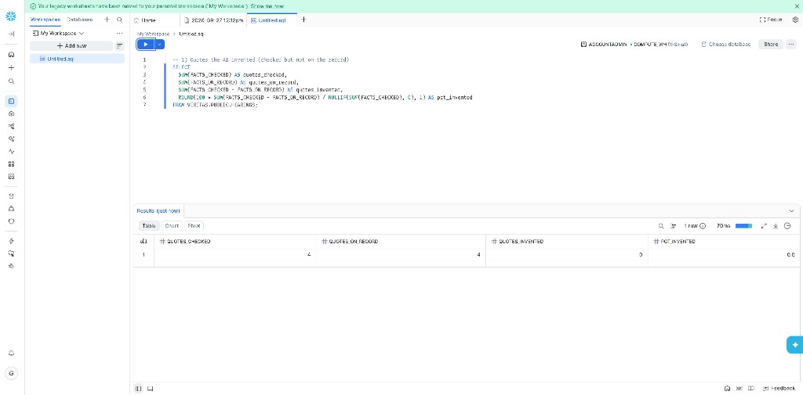
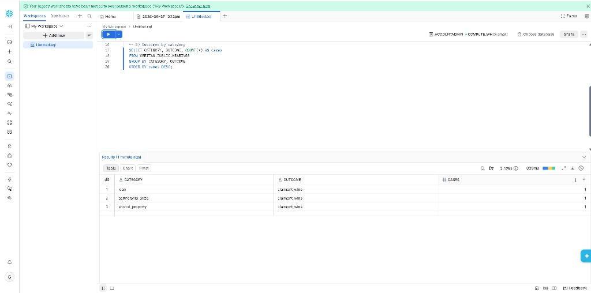

# Veritas · The AI Arbitrator

Hack Atlantic 2026 booth demo. Two people take the stand over a small money fight. A live judge hears both sides, then a written decision comes from what was actually said.

This is a mock small-claims bench. It is **not** a real court and **not** legal advice.

## What it does

- **Two stands.** Claimant and defendant each get a turn. The live judge (ElevenLabs) hears them and stays on the record.
- **Files on the bench.** Photos, notes, or PDFs can be filed as exhibits.
- **Written judgment.** Gemini drafts the outcome, the money, the laws, and a spoken ruling.
- **Record check.** The model has to show short quotes. We check those quotes against the real transcript and flag anything that was not said.
- **Second look.** A separate Gemini pass can agree or disagree. If it fails, the first verdict still stands.
- **Money and laws.** Awards are checked against the testimony and the province small-claims cap. Known statutes get a ✓.
- **Booth extras.** EN / FR for the UI, a short training walkthrough, case IDs, and saved hearings on this browser. If Gemini is down, a local rules fallback still decides.

The judge and Gemini stay in English. Only the buttons and labels switch language.

## Run

```bash
npm install
npm run dev
```

Open the URL Vite prints (often `http://localhost:5173` or `5175`).

Copy `.env.example` to `.env` and add `VITE_GEMINI_API_KEY`. Do not commit `.env`.

## Snowflake (Hack Atlantic side track)

The live booth does not call Snowflake. After a hearing, we export the record-check scores and load them into Snowsight as `VERITAS.PUBLIC.HEARINGS`. SQL in [`snowflake/audit.sql`](snowflake/audit.sql) audits the AI judge: invented quotes vs quotes on the record, whether the second look agreed, and outcomes by category.

Sample export: [`snowflake/hearings.csv`](snowflake/hearings.csv).

Quotes checked vs on the record (0 invented in this sample):



Cases by category:


